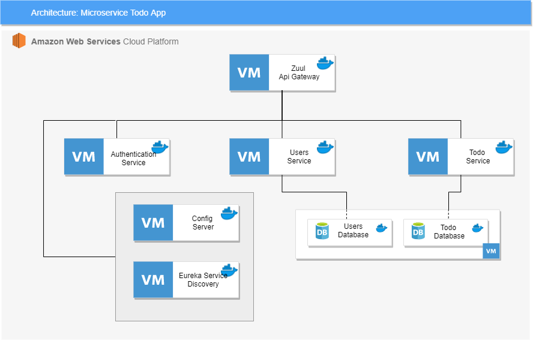

# Microservice Todo App

This is a TODO manager, it is build using Spring Boot and Spring Cloud, 




## Requeriments

* Java 8 (or higher)
* Maven
* Java Cryptography Extension (JCE)
* MySQL

## Installation

Run on every microservice folder

```
$ mvn clean package
```

Or run this command on project folder

```
$ for d in ./*/ ; do (cd "$d" && mvn clean package); done
```

## Run

Run these commands on project folder following this order

```
$ java -jar config-server/target/config-server-0.0.1-SNAPSHOT.jar

$ java -jar eureka-server-discovery/target/eureka-server-discovery-0.0.1-SNAPSHOT.jar

$ java -jar zuul-load-balancer/target/zuul-load-balancer-0.0.1-SNAPSHOT.jar

$ java -jar authentication-service/target/authentication-service-0.0.1-SNAPSHOT.jar

$ java -jar todo-service/target/todo-service-1.0.jar

$ java -jar user-service/target/user-service-0.0.1-SNAPSHOT.jar


$ java -jar target/authentication-service-0.0.1-SNAPSHOT.jar
```

## Main Endpoints


`POST http://<zuul-gateway-domain>:8011/users-service/users` Create new user 

```
{
	"firstName": "Luis",
	"lastName": "Araujo",
	"email": "luis@test.test",
	"password": "foo"
}
```

`POST http://<zuul-gateway-domain>:8011/authentication-service/login` Login 

```
{
    "email": "luis@laureate.net",
    "password": "foo"
}
```
Return JWT Token which is required on the following endpoints as a Authorization Bearer Header


`POST http://<zuul-gateway-domain>:8011/todo-service/todos` Create new TODO
```
{
	"userId": 1,
	"completed": false,
	"description": "Implement Service"
}
```

`GET  http://<zuul-gateway-domain>:8011/users-service/users/:userId/todos` Get user's TODO


## Docker elasticserach

Elasticsearch

docker network create --driver bridge elk-network   

```
docker run -d -v esdata1:/usr/share/elasticsearch/data --name elasticsearch -p 9200:9200 -p 9300:9300 -e "discovery.type=single-node" --network elk-network elasticsearch:7.3.0
```

Kibana
```
docker run -d -p 5601:5601 --network elk-network kibana:7.3.0
```

